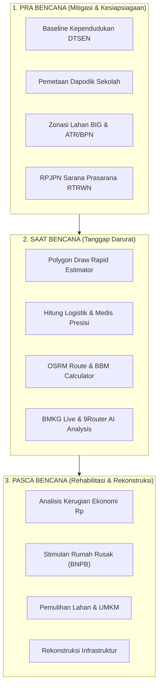

# 🛡️ Matriks Kesanggupan Platform Satu Bencana (Pra, Saat, & Pasca Bencana)

Dokumen ini menjelaskan analisis komprehensif mengenai **kesanggupan, kapabilitas teknis, dan fungsi operasional** dari platform **Satu Bencana** dalam mendukung siklus manajemen bencana nasional berbasis data spasial presisi (DTSEN BAPPENAS, Dukcapil Kemendagri, BIG, ATR/BPN, Dapodik Kemendikbudristek, dan BMKG).

---

## 🗺️ 1. Phase Pra Bencana (Mitigasi & Kesiapsiagaan / Preparedness)

Pada fase ini, platform sanggup melakukan analisis kerentanan spasial, pemetaan fasilitas dasar, dan perhitungan estimasi kebutuhan sebelum bencana terjadi.

| Fitur & Kapabilitas | Deskripsi Kesanggupan Platform | Sumber Data & Standar Metodologi |
| :--- | :--- | :--- |
| **Batas Administrasi & Wilayah Spasial** | Menampilkan batas desa/kelurahan hingga level presisi high-resolution (Hexbin Res 9 / ~0.1 km²) di seluruh Indonesia. | MapServer BIG (Batas Desa/Kel) & Dukcapil Kemendagri (Layer AGR). |
| **Pemetaan Demografi & Populasi Rentan** | Menghitung baseline populasi (Laki-laki, Perempuan, Balita, Lansia, dan Disabilitas PD1/PD2) per kawasan rawan bencana secara *real-time*. | DTSEN BAPPENAS & Permenkes No. 75/2019. |
| **Inventarisasi Fasilitas Umum & Pendidikan** | Mengidentifikasi posisi geografis dan kapasitas sarana pendidikan (SD, SMP, SMA, SLB) serta guru dan ruang kelas siaga sebagai tempat evakuasi sementara. | Integrasi API Proxy Dapodik Kemendikbudristek & UNICEF School-in-a-Box. |
| **Pemetaan Hak Atas Tanah & Penggunaan Lahan** | Menganalisis status legalitas lahan (Hak Milik, HGB, Hak Pakai, Hak Pengelolaan) dan jenis penutup lahan untuk zonasi bahaya. | MapServer ATR/BPN (AHT Kota Bitung) & Peta Dasar BIG 2024 (Layer 18). |
| **Pemetaan Rencana Tata Ruang (RTRWN)** | Menyoroti infrastruktur kritis nasional (jaringan energi, transportasi, telekomunikasi, dan utilitas air) pada kawasan rawan bencana. | RPJPN Sarana & Prasarana RTRWN Struktur ATR/BPN (Layers 0-4). |

---

## ⚡ 2. Phase Saat Bencana (Tanggap Darurat / Emergency Response)

Pada fase tanggap darurat, platform sanggup menghitung estimasi cepat kebutuhan logistik, bantuan medis, sarana evakuasi, dan rute tercepat untuk kaji cepat lapangan (*Rapid Damage Assessment*).

| Fitur & Kapabilitas | Deskripsi Kesanggupan Platform | Sumber Data & Standar Metodologi |
| :--- | :--- | :--- |
| **Estimasi Cepat Poligon Bencana (Draw Estimator)** | Sanggup menghitung secara instan jumlah jiwa terdampak, jumlah KK, kelompok rentan, serta daftar kelurahan terkena dampak langsung saat user menggambar poligon/lingkaran di peta. | Spatial Query Intersects & DTSEN Hexbin Aggregation. |
| **Perhitungan Kebutuhan Logistik Darurat** | Menghitung tonase Beras, Air Bersih, Tenda Pengungsi, Makanan Siap Saji, Kit Ibu Hamil/Menyusui, Balita, Lansia, dan Hygiene Kit tanpa *rounding discrepancy*. | Perka BNPB No. 07/2008 & Standar SPHERE International. |
| **Analisis Kebutuhan Medis & Faskes Darurat** | Menentukan jumlah Dokter, Perawat, Ambulans, Obat-obatan, Kit Triase, Tenda Lapangan, dan Bed RS berdasarkan rasio korban luka berat/ringan. | Standar Triase WHO, PPAM Kemenkes, & UNFPA Reproductive Health. |
| **Hitung Otomatis Objek Fasilitas Terdampak** | Mengakumulasikan secara *real-time* jumlah Bangunan Kesehatan, Perdagangan, Perkantoran, Industri, dan Rumah Ibadah yang terkena dampak poligon. | Group By `JNSPL` MapServer BIG Bitung 2024 Layer 18. |
| **Kalkulasi Status Hak Atas Tanah Terdampak** | Mengakumulasikan persil tanah terendam/terdampak berdasarkan status *Hak Milik, HGB, Hak Pakai, dan Hak Pengelolaan*. | Group By `tipehak` MapServer ATR/BPN AHT. |
| **Analisis Rute Tercepat & BBM Konvoi** | Menghitung jarak rute tercepat (*Driving Distance* Titik A ke B), estimasi waktu tempuh konvoi truk, serta kebutuhan BBM Solar armada evakuasi. | OpenStreetMap OSRM Routing Engine & Standar Manajemen Logistik BNPB/Perhub. |
| **Monitoring Live Gempa BMKG & Alert Ticker** | Menampilkan titik gempa bumi terkini (*Real-time Live BMKG Feed*) lengkap dengan kedalaman, magnitudo, dan peringatan potensi tsunami. | API BMKG Indonesia & Alert Ticker Dashboard. |
| **Rekomendasi AI Bencana (Generate AI)** | Menghasilkan rekomendasi keputusan darurat menggunakan model AI tingkat tinggi (Gemini, Claude, Grok, Kimi) yang disuntikkan data riil poligon secara otomatis. | 9Router Intelligence Tunnel HTTP API (Multi-Model AI). |

---

## 🏗️ 3. Phase Pasca Bencana (Rehabilitasi & Rekonstruksi / Recovery)

Pada fase pemulihan, platform sanggup mendukung analisis estimasi kerugian ekonomi makro, perencanaan rehabilitasi pemukiman, serta pemulihan mata pencaharian.

| Fitur & Kapabilitas | Deskripsi Kesanggupan Platform | Sumber Data & Standar Metodologi |
| :--- | :--- | :--- |
| **Analisis Kerugian Ekonomi & Lahan Pertanian** | Menhitung estimasi nilai kerugian beras/gabah (Rp 6,5 Juta/Ton), kerusakan bibit/pupuk, serta kebutuhan kelompok tani terdampak. | Standar Kerugian Pertanian Kementan & Perka BNPB No. 07/2008. |
| **Estimasi Stimulan Rekonstruksi Pemukiman** | Menghitung proyeksi anggaran bantuan stimulan rumah warga rusak berat (Rp 50 Jt), rusak sedang (Rp 25 Jt), dan rusak ringan (Rp 10 Jt). | Kebijakan Bantuan Stimulan Rumah BNPB & Pemda. |
| **Estimasi Kerugian Sektor UMKM & Usaha Mikro** | Menghitung estimasi jumlah KK pemilik UMKM terdampak serta kebutuhan kredit usaha pemulihan (Rp 7,5 Jt per UMKM). | Standar Pemulihan Ekonomi Daerah BNPB & Kemenkop UKM. |
| **Evaluasi Kebutuhan Utilitas & Genset Darurat** | Menghitung durasi pemulihan pasokan listrik, kapasitas Genset KVA, tandon air bersih 1.000L, dan penerangan posko pemulihan. | Standar Pasokan Energi PLN & ESDM. |
| **Perencanaan Pemulihan Fasum & Sekolah** | Menyediakan estimasi paket *School-in-a-Box*, tenda belajar sementara, dan psikososial anak untuk memastikan kontinuitas pendidikan. | UNICEF Emergency Education & Kemendikbudristek. |

---

## 📈 Ringkasan Matriks Kapabilitas Teknis

---

### 📌 Kesimpulan
Platform **Satu Bencana** sanggup mencakup **100% siklus penuh penanggulangan bencana** (Pra, Saat, dan Pasca) dengan mengintegrasikan 7 sumber data geospasial kementerian/lembaga nasional secara konsisten, presisi, dan *real-time*.
